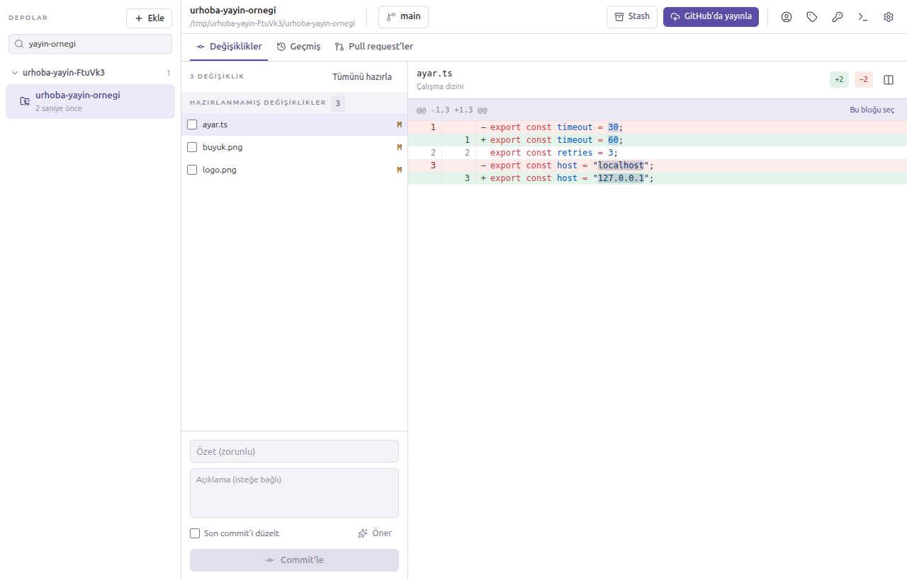
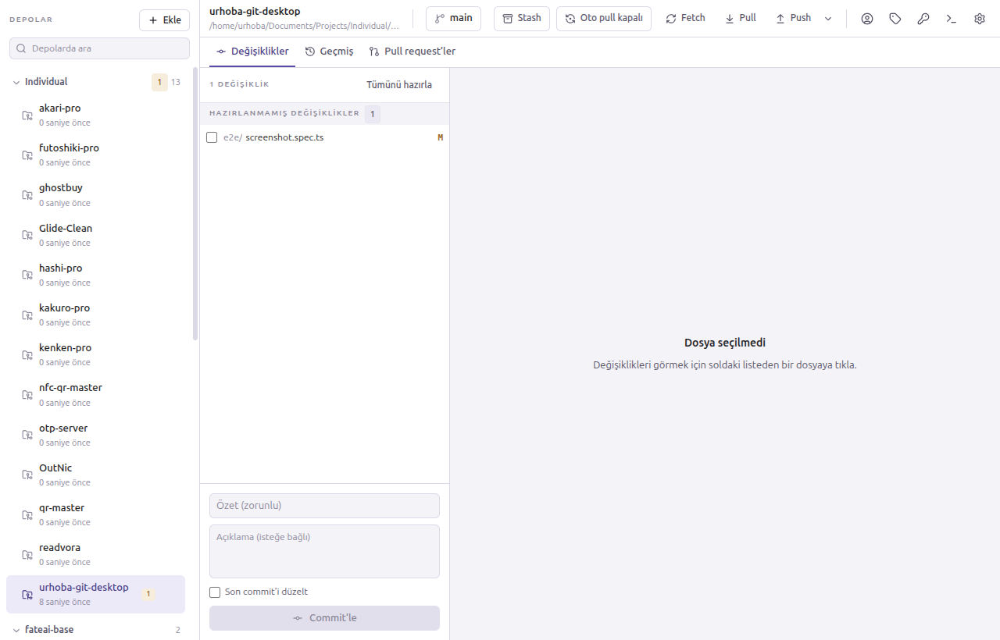
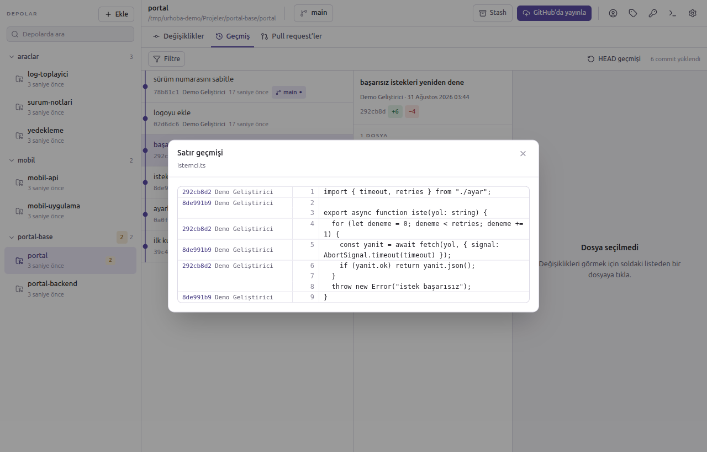
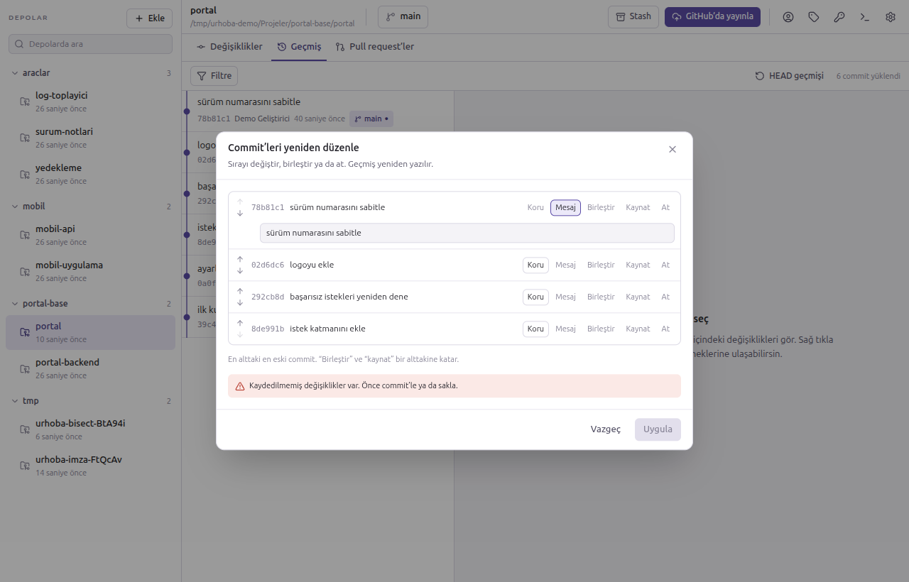
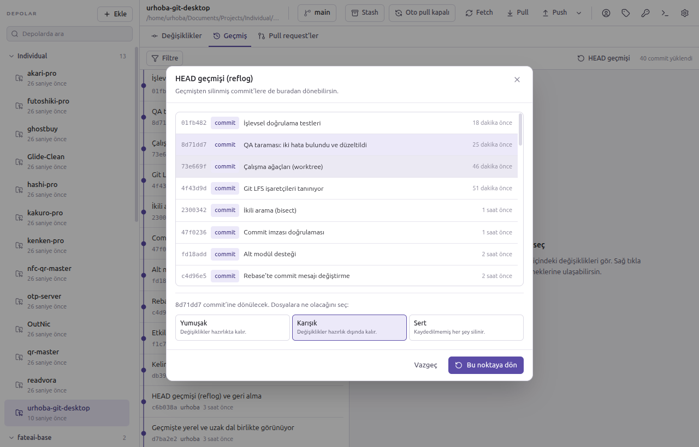
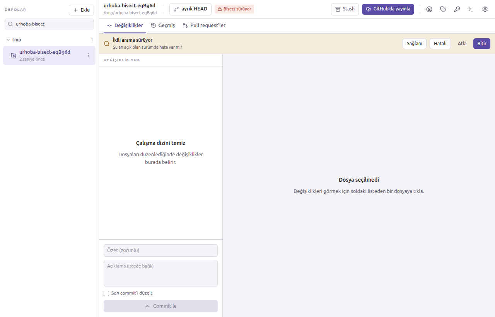
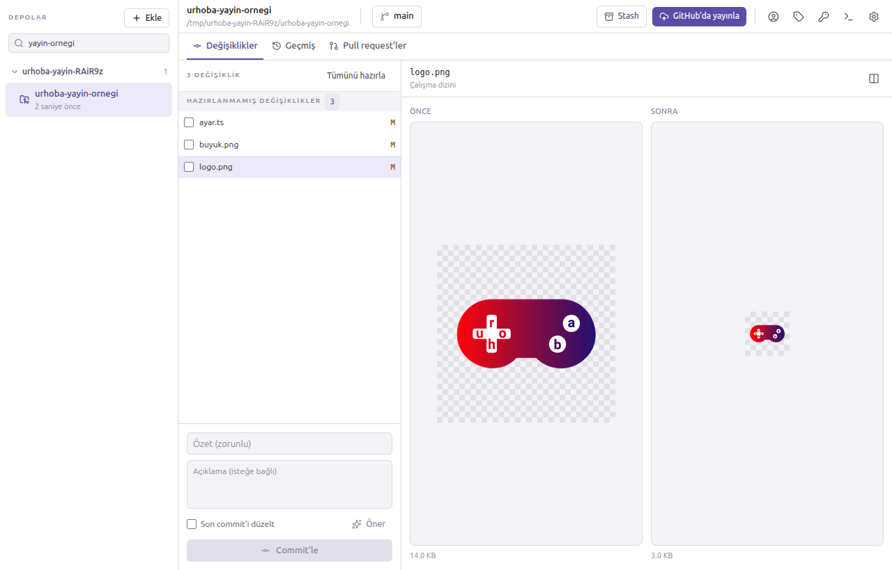
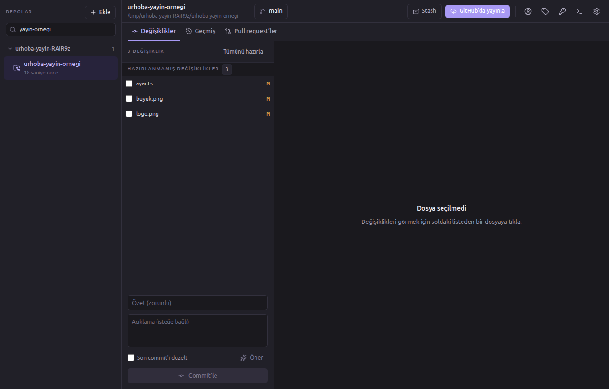

<h1 align="center">
  <br />
  Urhoba Git Desktop
</h1>

<p align="center">
  Depolarını tek pencereden takip eden, Türkçe konuşan modern bir masaüstü Git istemcisi.<br />
  <strong>Sistemde git kurulu olmasına gerek yok</strong> — kendi git sürümünü taşıyor.
</p>

<p align="center">
  <a href="https://github.com/ahmetbohur/urhoba-git-desktop/actions/workflows/ci.yml"></a>
  
  
  
</p>

<p align="center">
  
</p>

## Neden

Git'in kendisi güçlü ama arayüzü değil. Komut satırında yaptığın her şey
ezberlenmiş bayraklara bağlı; mevcut masaüstü istemcileri ise ya İngilizce ya da
yaptığı şeyi anlatmadan yapıyor.

Urhoba iki şeye önem veriyor:

- **Ne olacağını önceden söylemek.** "Sert sıfırlama geri alınamaz" demek yerine
  kaç dosyadaki değişikliğin silineceğini yazıyor. Rebase kirli çalışma
  dizininde başlamayacaksa düğme daha basılmadan kapalı ve sebebi yazılı.
- **Kaybolan bir şey olmaması.** Yanlış bir reset'ten sonra çalışman HEAD
  geçmişi (reflog) ekranından geri geliyor.

## Neler yapabiliyor

### Günlük iş

**Depo yönetimi** — Yerel klasörden ekleme, bir klasör ağacını tarayıp içindeki
bütün depoları toplu ekleme, SSH/HTTPS adresinden ilerleme göstergeli klonlama.

**Düzen** — Depolar klasör yapısından çıkarılan gruplara ayrılır; gruplar
katlanır, yeniden adlandırılır, depolar gruplar arasında taşınır. Sık
kullanılanlar üste sabitlenir, etiketlerle süzülür, grup başlığında o gruptaki
kaydedilmemiş değişiklik sayısı görünür.

<p align="center">
  
</p>

**Değişiklikler** — Hazırlanmış/hazırlanmamış ayrımı, sözdizimi renklendirmeli
diff (tek sütun veya yan yana), onaylı geri alma, commit ve son commit'i
düzeltme.

**Satır bazlı hazırlama** — Diff üzerinde tek tek satır seçip yalnızca onları
hazırla, hazırlıktan çıkar ya da geri al. Aynı dosyadaki iki ayrı değişikliği
ayrı commit'lere bölmek için.

**Kelime düzeyinde fark** — Değişen satırlarda yalnızca değişen kelimeler
vurgulanır; uzun bir satırda tek sayı değiştiğinde satırın tamamını okumak
gerekmez.

**Dallar** — Aranabilir menü, ahead/behind rozetleri, merge, rebase, yeniden
adlandırma ve silme. Kaydedilmemiş değişiklik geçişi engellerse hangi dosyaların
engellediğini söyler ve tek tıkla saklayıp geçmeyi önerir.

**Çakışma çözümü** — Sabit bir şerit durumu ve iki çıkışı (devam et / iptal et)
sürekli gösterir. Çakışan dosyada her blok için "bizimki / onlarki / ikisi"
seçimi; karmaşık durumlar için "editörde aç" kaçış kapısı.

### Geçmiş ve kurtarma

**Geçmiş** — Dallanma çizgileriyle commit grafiği, sanal kaydırmalı liste,
commit detayı, yazara/mesaja/dosyaya/tarihe göre filtreleme.

**Satır geçmişi (blame)** — Her satırı kimin hangi commit'te yazdığını gösterir;
bir satıra tıklayınca o commit geçmişte açılır.

<p align="center">
  
</p>

**Etkileşimli rebase** — Sırayı değiştir, mesajı değiştir, bir öncekiyle
birleştir, tamamen at. Kaydedilmemiş değişiklik varken ya da yarım işlem
sürerken düğme kapalı kalır.

<p align="center">
  
</p>

**HEAD geçmişi (reflog)** — HEAD'in geçmişte durduğu noktalara döndürür. Commit
geçmişinden silinmiş çalışmaya ulaşmanın tek yolu bu.

<p align="center">
  
</p>

**İkili arama (bisect)** — Hatanın hangi commit'te girdiğini bulur; her adımda
üstteki şeritten *sağlam / hatalı / atla* denir.

<p align="center">
  
</p>

**Geçmişi değiştirme** — Revert, reset (soft/mixed/hard, her birinin ne yaptığı
yazılı) ve cherry-pick.

### Uzak sunucu ve GitHub

**Uzak sunucular** — Fetch, pull, push; upstream yoksa push sırasında otomatik
kurulum. Zorlamalı gönderim yalnızca `--force-with-lease` ile: uzak dalda
görmediğin bir commit varsa git reddeder, yani başkasının çalışması sessizce
silinmez.

**Otomatik pull** — Ayarlanabilir aralıkta arka planda çalışır. Varsayılanları
bilinçli olarak temkinli: çalışma dizini kirliyken dokunmaz ve yalnızca
fast-forward yapar.

**GitHub** — Cihaz akışıyla giriş (jetonla uğraşmadan), açık pull request
listesi, PR dalına geçme, mevcut daldan PR açma, GitHub depolarını arayıp
klonlama ve **yerel bir depoyu tek pencereden GitHub'da yayınlama**
(özel/herkese açık seçimiyle).

### Özel dosya türleri

**İkili dosya önizlemesi** — Görüntü, video, ses ve yazı tipi dosyalarında diff
yerine içeriğin kendisi, eski ve yeni hâli yan yana gösterilir.

<p align="center">
  
</p>

**Git LFS** — İşaretçi dosyalarda sha256 satırları yerine dosyanın boyutu
gösterilir; git-lfs kurulu olmasa da tanınır.

**Alt modüller** — Alt modülün *neyinin* değiştiği yazar (commit mi, içerideki
kaydedilmemiş çalışma mı, takip edilmeyen dosyalar mı). Kurulmamış alt modül
varsa uyarı şeridi çıkar ve tek tıkla kurulur.

**Çalışma ağaçları** — Başka klasörde açık dallar menüde soluk görünür ve
nerede açık oldukları yazar.

### Diğer

**AI yardımı (isteğe bağlı, varsayılan kapalı)** — Commit mesajı, depo tanıtımı
ve gruplama önerisi; Ollama (yerel), OpenAI veya Claude ile.

**Commit imzaları** — İmzalı commit'lerde doğrulama durumu görünür.

**Türkçe ve İngilizce arayüz** — Tek tıkla değişir; tarih biçimleri ve uygulama
menüsü de dile uyar.

**Komut paleti** — `Ctrl/Cmd + K` ile depo değiştir, dal değiştir,
fetch/pull/push, stash. Kısayollar paletle aynı listeden geldiği için gösterilen
tuş her zaman çalışan tuş.

**Açık ve koyu tema** — Sistemi izler ya da elle seçilir.

<p align="center">
  
</p>

**Git komut günlüğü** — Çalışan her git komutu, süresi ve hatası görünür. Ne
yaptığımızı gizlemiyoruz.

## Gizlilik

- **Jetonlar arayüze hiç ulaşmaz.** GitHub jetonu ve AI anahtarları yalnızca ana
  süreçte tutulur, işletim sisteminin anahtarlığıyla şifrelenerek yazılır.
  Anahtarlık yoksa diske hiç yazılmaz, yalnızca o oturum boyunca bellekte kalır.
- **AI varsayılan olarak kapalı**, varsayılan sağlayıcı yerel (Ollama). Bulut
  sağlayıcıya kod göndermek ayrıca izin ister ve bu izin depo başına verilebilir.
- **Uygulama hiçbir SSH özel anahtarını kendi saklamaz**; sistemdekileri kullanır.
- Telemetri yok.

## Kurulum

### Linux

`.deb` dosyasını [Releases](https://github.com/ahmetbohur/urhoba-git-desktop/releases)
sayfasından indir:

```bash
sudo dpkg -i urhoba-git-desktop_*_amd64.deb
```

### Kaynaktan

```bash
git clone https://github.com/ahmetbohur/urhoba-git-desktop.git
cd urhoba-git-desktop
npm install
npm start
```

Kurulum dosyası üretmek için `npm run make`. RPM yalnızca `rpmbuild` kuruluysa
üretilir; yoksa `.deb` üretimi engellenmeden sürer.

macOS derlemesi bir Mac üzerinde yapılmalı — gömülü git platforma özgü olduğu
için Linux'ta üretilen bir `.app` çalışmıyor. İmzalama ve notarization ortam
değişkenleri tanımlıysa kendiliğinden devreye giriyor; ayrıntılar
[docs/mimari.md](docs/mimari.md) içinde.

> **Not:** Windows derlemesi imzalanmıyor. İmzasız kurulumda SmartScreen
> "Windows protected your PC" uyarısı verir; **More info → Run anyway** ile
> geçilir.

## Klavye kısayolları

| Kısayol | Ne yapar |
| --- | --- |
| `Ctrl/Cmd + K` | Komut paleti |
| `Ctrl/Cmd + 1` / `2` / `3` | Değişiklikler / Geçmiş / Pull request'ler |
| `Ctrl/Cmd + Shift + F` | Fetch |
| `Ctrl/Cmd + Shift + L` | Pull |
| `Ctrl/Cmd + Shift + P` | Push |
| `Ctrl/Cmd + Shift + S` | Değişiklikleri sakla |
| `Ctrl/Cmd + Shift + G` | Git komut günlüğü |
| `Ctrl/Cmd + Enter` | Commit |

## Geliştirme

```bash
npm start          # geliştirme modunda başlat
npm run typecheck  # tip denetimi
npm run lint       # ESLint
npm test           # birim + entegrasyon testleri
npm run test:e2e   # paketleyip uçtan uca testleri çalıştırır
npm run test:all   # birim + uçtan uca
```

İnceleme araçları (varsayılan koşunun dışında):

```bash
npm run screenshots # arayüz görüntüleri üretir
npm run qa          # uç durumları ve koyu temayı gezer
npm run test:ai     # AI akışlarını gerçek bir Ollama sunucusuyla dener
```

Geliştirme için Node.js 20+ yeterli.

### Test yaklaşımı

Testler üç katmanda: ayrıştırıcılar saf fonksiyon olarak, git komutları geçici
depolarda **gerçek git süreçleriyle**, ve `e2e/functional.spec.ts` uygulamanın
kendisini çalıştırıp sonucu doğrudan git'e sorarak. Sonuncusu önemli: uygulama
"oldu" dediği için değil, depo gerçekten değiştiği için geçiyorlar.

## Mimari

```
src/
├── main/        Electron ana süreci — git komutları, dosya izleme, ayarlar
├── preload/     güven sınırı — contextBridge ile window.urhoba
├── shared/      iki tarafın da kullandığı tipler ve IPC sözleşmesi
└── renderer/    React arayüzü
```

Üç kural bel kemiği: **renderer'ın Node erişimi yok**, **IPC sözleşmesi tek
kaynaktan** (bir kanalı eklemeyi ya da işleyicisini yazmayı unutmak derleme
zamanında hata veriyor) ve **depo başına komut sırası** (aynı depoda eşzamanlı
iki yazma `index.lock` hatası veriyor).

Kararların gerekçeleri ve her özelliğin nasıl çalıştığı
**[docs/mimari.md](docs/mimari.md)** dosyasında.

## Yol haritası

Planlanan özelliklerin tamamı kodlandı. Kalanlar:

- Kod imzalama (macOS ve Windows) ve otomatik güncelleme için ilk yayın
- Sürekli tümleştirme (CI)
- GitLab / Bitbucket desteği — sağlayıcı arayüzü hazır, uygulaması yok

## Lisans

MIT
